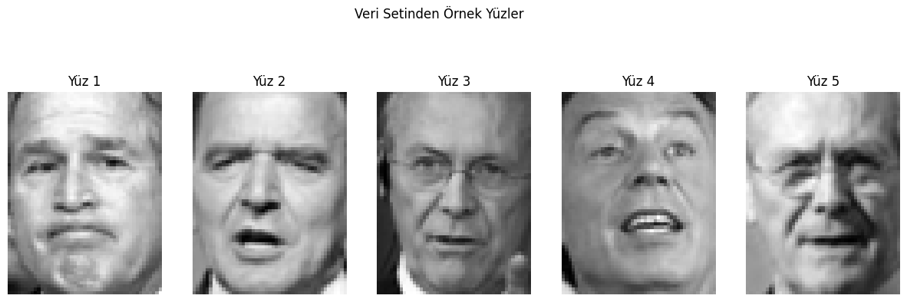
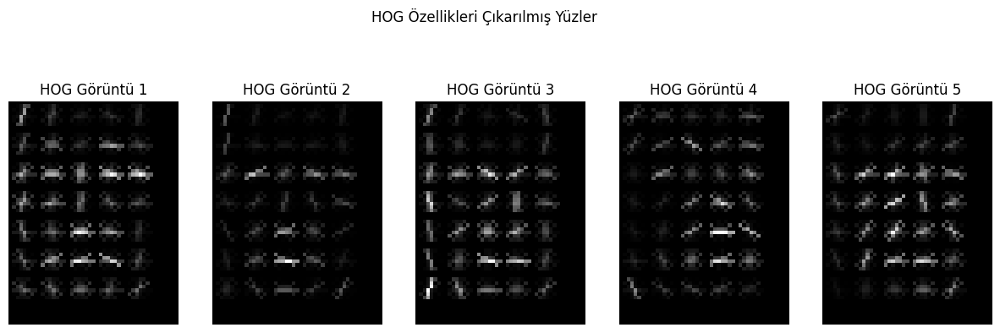
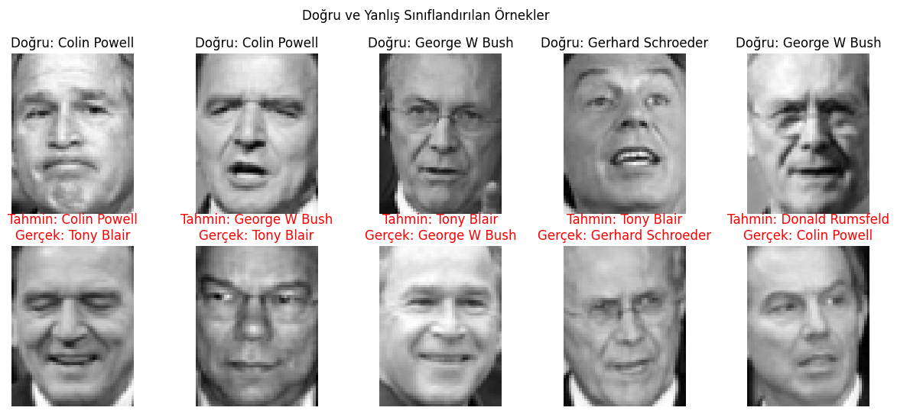

# Histogram of Oriented Gradients (HOG) — Face Recognition

A face recognition pipeline using HOG feature extraction and SVM classification on the LFW (Labeled Faces in the Wild) dataset.

## Pipeline

1. **Dataset Loading** — LFW dataset filtered to people with 100+ face images
2. **HOG Feature Extraction** — 9 orientations, 8×8 pixels per cell, 2×2 cells per block
3. **Train/Test Split** — 70% training, 30% testing
4. **SVM Training** — Linear kernel Support Vector Machine
5. **Evaluation** — Accuracy score + visualization of correct/incorrect predictions

## Results

### Sample Faces from LFW Dataset

### HOG Feature Visualization

### Correct vs Incorrect Classifications

## Tech Stack

- **Feature Extraction**: HOG (scikit-image)
- **Classifier**: SVM with linear kernel (scikit-learn)
- **Dataset**: LFW (Labeled Faces in the Wild)
- **Visualization**: Matplotlib

## Notebook

| File | Description |
|------|-------------|
| `HOG.ipynb` | Full pipeline: data loading, HOG extraction, SVM training, evaluation, visualization |
